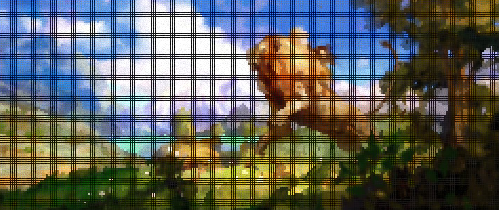

"Chào mừng bạn đến với TheDiary.dev, nơi tôi, một người đã từng đắm chìm trong thế giới lập trình, sẽ chia sẻ niềm đam mê với bạn. Ban đầu, lập trình dành cho tôi những trải nghiệm đầy mê hoặc. Nhưng sau một thời gian dài trong nghề, mọi thứ dần trở nên nhàm chán, nguội lạnh. Để thắp lại ngọn lửa đam mê, tôi quyết định bắt tay vào viết blog, nơi mà tôi chia sẻ kiến thức, kinh nghiệm và những trải nghiệm mà tôi đã có.

Tại TheDiary.dev, tôi muốn tập trung vào tổng quan về kiến trúc và cách thiết kế hơn là chỉ tập trung vào việc học một công nghệ hay ngôn ngữ mới. Những kiến thức được chia sẻ đôi khi là những điều tôi thu lượm được và muốn ghi chép lại, không chỉ như một hình thức tự học, tự ghi nhớ mà còn là những trải nghiệm thực tế từ công việc hàng ngày.

Tôi mong muốn kiến thức mà tôi chia sẻ sẽ vừa mang tính học thuật vừa thực dụng. Tôi luôn ưu tiên những giải pháp đơn giản, nhanh, gọn và đủ, thay vì những giải pháp cồng kềnh, phức tạp và quá trừu tượng. Tôi tin rằng, ta chỉ cần xét tới những biến số khi thực sự cần thiết, không cần phải lo lắng về những điều chưa xảy ra.

Hãy cùng tôi khám phá thế giới lập trình qua góc nhìn của một người thực hành, và cùng nhau tìm hiểu, trải nghiệm và chia sẻ."

Hy vọng bạn sẽ thích blog này! Cảm thấy chán thì viết 1 cái blog nhé :)