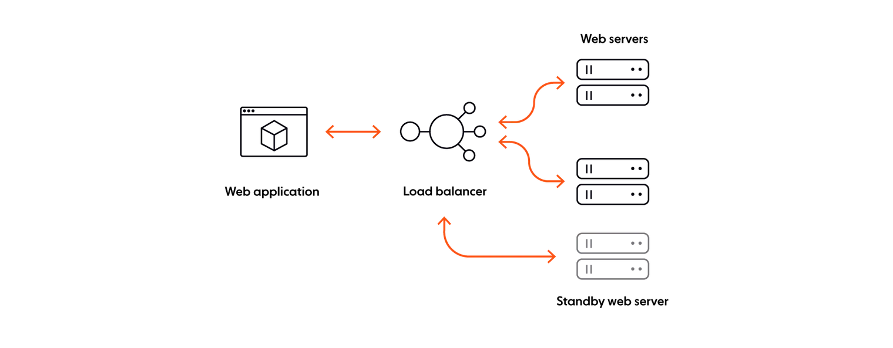
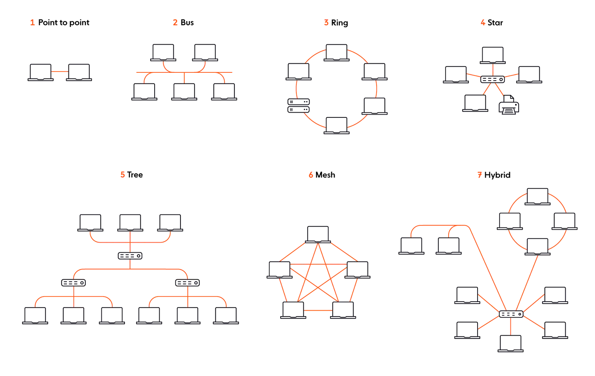

## Các sai lầm ngộ nhận nào thường gặp trong hệ thống phân tán?
Để xây dựng hệ thống phân tán, chúng ta đều biết rằng là điều không phải dễ dàng. Ngây cả 1 hệ thống đơn giản cũng bao gồm 1 vài nodes và sẽ tiến hóa dần trở nên phức tạp hơn.
Các nodes này phải giao tiếp với nhau thông qua 1 mạng network. Tuy nhiên 1 trong số chúng có thể bị lỗi hoặc bản thân mạng network chính nó có thể bị đứt kết nối hay có độ trễ cao.

Khi thiết kế hệ thống phân tán, ta phải luôn giả định là mọi thứ sẽ không luôn luôn hoạt động theo đúng như mong muốn. Ta phải nhận thức được rằng có những hạn chế và thách thức mà ta sẽ cần phải vượt qua.

Để hiểu rõ hơn những thách thức đi kèm với các hệ thống phân tán cần đảm bảo đáng tin cậy về mặt kỹ thuật, ta phải tham khảo những sai lầm của hệ thống phân tán — một danh sách các giả định sai lầm mà architects và developers có thể ngộ nhận:
1. Mạng Network là đáng tin cậy.
2. Độ trễ mạng Latency là 0.
3. Băng thông mạng Bandwidth là vô hạn.
4. Mạng Network là an toàn.
5. Cấu trúc liên kết Topology không bao giờ thay đổi.
6. Chỉ có duy nhất 1 quản trị viên Administrator.
7. Chi phí chung chuyển Transport cost là 0.
8. Mạng Network là đồng nhất.

## 1. Mạng Network là đáng tin cậy
Trước khi nói về lầm tưởng đầu tiên này, ta cần định nghĩa nhanh độ tin cậy reliable của mạng network là gì. Ta định nghĩa độ tin cậy là mức độ mà một sản phẩm hoặc dịch vụ tuân thủ các thông số kỹ thuật của nó khi sử dụng, ngay cả trong trường hợp lỗi.
Do vậy ta có thể hiểu 1 cách ngắn gọn độ tin cậy chính là chất lượng của thời gian uptime.

Giờ quay trở lại sai lầm mà ta đang phân tích. Mạng Network bản chất là phức tạp, linh động và thường khó dự đoán. Có rất nhiều lý do có thể khiến mạng network gặp lỗi hay các vấn đề liên quan đến network:
như bộ định tuyến switch hay bộ cấp nguồn power bị lỗi, hay như việc cấu hình sai, hay như cả 1 vùng mạng bị đứt kết nối, tấn công DDoS, ... Tương xứng với yếu tố phức tạp này và thông thường không thể dự đoán trước được, thì mạng Network là không đáng tin cậy.

Vậy cách nào để khiến 1 hệ thống phân tán trở nên tin cậy, và đảm bảo nó hoạt động đúng như mong muốn ngay cả trong hoàn cảnh mạng network là không tin cậy?

Câu trả lời là điều quan trọng là phải chấp nhận và coi việc gặp lỗi là điều đương nhiên. Ta nên thiết kế hệ thống để giảm thiểu các lỗi chắc chắn sẽ xảy ra và nó sẽ tiếp tục hoạt động như mong muốn bất chất nghịch cảnh.

Cụ thể, từ góc độ cơ sở hạ tầng, ta cần thiết kế hệ thống của mình để có khả năng chịu lỗi và dự phòng cao.

Ngoài các mối quan tâm về cơ sở hạ tầng, ta cũng cần nghĩ đến việc kết nối connection bị đứt, tin nhắn messages và lệnh gọi API bị mất do lỗi mạng. Ví dụ 1 vài ứng dụng như realtime chat app, thì việc toàn vẹn dữ liệu là cần thiết và 
mọi messages cần được gửi đi chính xác chỉ một lần theo đúng thứ tự tới end-users vào mọi thời điểm (ngay cả khi có lỗi xảy ra). 
Để đảm bảo toàn vẹn dữ liệu, hệ thống của ta cần phải thể hiện các đặc điểm trạng thái -  stateful characteristics. Do đó, ta cần các cơ chế như việc tự động kết nối lại - reconnection và tự động gửi lại - retries, chống trùng lặp - deduplication,
và cách thức để đảm bảo thứ tự message - ordering và đảm bảo việc gửi đi - delivery.

## 2. Độ trễ mạng Latency là 0
Độ trễ mạng có thể gần như bằng 0 khi ta chạy ứng dụng app tại môi trường local, và nó thường bị không được lưu tâm tới khi chạy trên cùng 1 mạng local network.
Tuy nhiên, độ trễ mạng Latency nhanh chóng tăng lên khi trong một vùng mạng network lớn hơn. Đó là bởi vì 1 WAN data thường phải trung chuyển qua nhiều nodes mạng khác nhau, do đó mạng network có thể trải rộng trên nhiều vùng địa lý.

Khi ta thiết kế hệ thống, ta luôn cần ghi nhớ rằng độ trễ latency luôn là 1 hạn chế cố hữu của networks. Ta không nên giả định rằng sẽ không bao giờ các độ trễ giữa việc gửi và nhận dữ liệu.

Độ trễ Latency chủ yếu bị hạn chế bởi khoảng cách và tốc độ ánh sáng. Tất nhiên, chúng ta không thể làm gì về cái sau (tấc độ ánh sáng - cáp quang). Ngay cả trong điều kiện mạng hoàn hảo về mặt lý thuyết, các gói tin không thể vượt quá tốc độ ánh sáng.
Tuy ta vẫn có thể tác động đến yếu tố khoảng cách như mang dữ liệu data đến gần hơn với clients thông qua việc đặt các server ở vùng biên.
Nếu ta đang xây dựng 1 hệ thống dựa trên điện toán đám mây, ta nên chọn vùng mạng availability zones 1 cách cẩn thận, và đảm bảo rằng chúng được đặt ở gần clients của ta và được định tuyến phù hợp.

Với độ trễ là điều luôn cần xem xét tới, đây là một số điều khác cần suy ngẫm:
- **Caching**: Browser caching có thể giúp cản thiện độ trễ và giảm số lượng requests được gửi tới server. Ta có thể sử dụng 1 CDN để cache các tài nguyên resources ở nhiều vị trí khác nhau trên khắp thế giới. Khi được cached, chúng có thể được truy cập nhanh hơn thông qua các datacenter hay các điểm ở gần client nhất.
- **Sử dụng 1 giao thức hướng sự kiện event-driven protocol**: Ta có thể xem xét sử dụng 1 phương thức kết nối như WebSockets. So sánh với HTTP, thì WebSockets có thời gian round-trip time ngắn hơn (khi kết nối đã được thiết lập). Hơn thế khi kết nối WebSocket connection vẫn đang mở, thì cho phép dữ liệu được truyền qua lại giữa máy chủ và máy khách ngay khi có sẵn, trong thời gian thực — một cải tiến đáng kể so với mô hình phản hồi yêu cầu HTTP.
- **Server performance**: Có mối tương quan chặt chẽ giữa hiệu suất máy chủ (tốc độ xử lý, phần cứng được sử dụng, RAM khả dụng) và độ trễ. Để ngăn mạng tắc nghẽn và máy chủ của ta không bị quá tải, ta cần có khả năng (linh động) tăng dung lượng của lớp máy chủ và chỉ định lại tải.

## 3. Băng thông mạng Bandwidth là vô hạn
Trong khi độ trễ latency là tấc độ dữ liệu di chuyển từ điểm A tới điểm B, thì băng thông bandwidth là số lượng dữ liệu có thể truyền đi từ điểm này tới điểm khác trong 1 phạm vi thời gian cụ thể.

Khi có lượng lớn dữ liệu chạy qua mạng network, và vượt ngưỡng băng thông của mạng, thì sẽ có 1 số vấn đề xảy ra như sau:
- Gia tăng độ trễ, nghẽn cổ chai, và tắc nghẽn mạng network.
- Mất gói dẫn đến đảm bảo chất lượng dịch vụ kém hơn, tức là tin nhắn bị thất lạc hoặc gửi không đúng thứ tự.
- Hiệu suất mạng kém và thậm chí là mất ổn định toàn bộ hệ thống.

Có nhiều cách để cải tiến băng thông mạng:
- **Comprehensive monitoring**: Thực hiện giám sát mạng, bản chất là kiểm tra và theo dõi mức sử dụng mạng, để có thể nhanh chống xác định sự cố (ví dụ: ai hoặc cái gì đang chiếm dụng băng thông của ta) và thực hiện biện pháp khắc phục thích hợp.
- **Multiplexing**: Thực hiện ghép kênh, sử dụng các giao thức như HTTP/2, HTTP/3, và WebSockets (tất cả đều hỗ trợ multiplexing) một kỹ thuật giúp cải thiện việc sử dụng băng thông bằng cách cho phép ta kết hợp dữ liệu từ nhiều nguồn và gửi dữ liệu đó qua cùng một kênh/phương tiện liên lạc.
- **Lightweight data formats**: Sử dụng các định dạng dữ liệu nhẹ như JSON, Protocol Buffers, và MessagePack. Các định dạng này có thể giúp giảm kích thước dữ liệu và tăng tốc độ truyền tải dữ liệu.
- **Network traffic control**: Sử dụng cơ chế kiểm soát lưu lượng mạng. Ta có thể sử dụng các cơ chế như throttling/rate limiting, congestion control, exponential backoff, ...

## 4. Mạng network là an toàn
[Gene Spafford (“Spaf”)](https://en.wikiquote.org/wiki/Gene_Spafford) 1 trong những nhà bảo mật hàng đầu thê giới, đã nói rằng: 
> “The only truly secure system is one that is powered off, cast in a block of concrete and sealed in a lead-lined room with armed guards – and even then I have my doubts.”
> 
> "Hệ thống duy nhất thực sự an toàn là hệ thống được tắt nguồn, đặt trong khối bê tông và được niêm phong trong 1 phòng chống cháy bằng chì với những người bảo vệ có vũ trang - và ngay cả khi đó tôi vẫn còn nghi ngờ."

Có rất nhiều cách để 1 mạng network có thể bị tấn công hay bị xâm nhập: các lỗi hệ thống, lỗi bảo mật trong hệ điều hành của hệ thống hay các thư viện, hay các giao tiếp chưa được mã hóa, hay các sơ suất dẫn đến dữ liệu bị truy cập trái phép, vi-rút và phần mềm độc hại, tập lệnh chéo trang (XSS) và tấn công DDoS, đó chỉ là một vài cái tên (trong danh sách vô tận các cách).

Mặc dù cái gọi là bảo mật tuyệt đối trong thế giới điện toán phân tán là một ngụy biện, tuy nhiên, bạn nên làm bất cứ điều gì trong khả năng của mình để ngăn chặn vi phạm và tấn công khi bạn thiết kế, xây dựng và kiểm tra hệ thống của mình. Mục đích là để các sự cố an ninh xảy ra càng ít càng tốt và có tác động cũng như ảnh hưởng càng hạn chế càng tốt.

Đây là 1 vài cách được xét đến để cải thiện an ninh mạng:
- **Threat modeling**: Đây là 1 kỹ thuật để xác định và đánh giá các mối đe dọa tiềm năng đối với hệ thống của bạn. Nó giúp bạn hiểu được các mối đe dọa tiềm năng và các điểm yếu của hệ thống của bạn, từ đó bạn có thể đưa ra các biện pháp phòng ngừa và giảm thiểu các rủi ro.
- **Defense in depth**: Đây là 1 chiến lược bảo mật mạng, nó bao gồm việc sử dụng nhiều lớp bảo mật khác nhau để bảo vệ hệ thống của bạn. Nó giúp bạn giảm thiểu các rủi ro bằng cách sử dụng nhiều lớp bảo mật khác nhau, nếu 1 lớp bảo mật bị xâm phạm thì các lớp bảo mật khác vẫn có thể ngăn chặn các cuộc tấn công.
- **Security mindset**: Đây là 1 tư duy, 1 cách tiếp cận để xây dựng hệ thống an toàn. Nó bao gồm việc tập trung vào các vấn đề bảo mật trong suốt quá trình phát triển hệ thống, từ đó giúp bạn tạo ra các hệ thống an toàn hơn. Bạn có thể thực hiện theo các best practices, các lời khuyên chỉ dẫn như [OWASP’s Top 10 list](https://owasp.org/www-project-top-ten/), và các công cụ để giúp bạn phát hiện các lỗ hổng bảo mật trong mã của bạn.

## 5. Cấu trúc liên kết Topology không bao giờ thay đổi
Nói 1 cách ngắn gọn topology mạng đề cập đến cách mà các liên kết và nút của mạng được sắp xếp và liên quan đến nhau.
Trong một hệ thống phân tán, topology mạng thay đổi liên tục. Đôi khi, điều này xảy ra vô tình hoặc do các vấn đề như máy chủ bị sự cố. Có những lúc thay đổi là cố ý - chúng ta thêm, nâng cấp hoặc loại bỏ máy chủ.

Khi thiết kế hệ thống phân tán, điều quan trọng cần ghi nhớ là  topology mạng luôn không nhất quán và sẽ không luôn hoạt động theo cách nhất định vào mọi thời điểm. Có nhiều loại topology mạng khác nhau mà ta có thể chọn sử dụng, mỗi loại đều có những ưu điểm và nhược điểm riêng.

Ví dụ, trong ring topology, mỗi nút kết nối chính xác với hai nút khác. Dữ liệu di chuyển từ nút này sang nút khác, trong đó mỗi nút xử lý từng gói tin. Một số lợi ích của việc sử dụng topology ring:
- Ta không cần một nút trung tâm để quản lý kết nối.
- Việc cấu hình lại tương đối dễ dàng.
- Có thể được thiết lập thành chế độ toàn đồng bộ (topology vòng kép), cho phép dữ liệu lưu thông hai chiều, theo chiều kim đồng hồ và ngược chiều kim đồng hồ.

Tuy nhiên, một điểm yếu của topology ring đơn là nó khá dễ bị sự cố. Nếu một nút bị hỏng, nó có thể làm hỏng toàn bộ mạng.

Hãy xem xét một loại topology khác: topology lưới (mesh topology). Trong topology lưới, không có điểm kết nối trung tâm, mà các nút được kết nối với nhau. Topology lưới sử dụng hai phương pháp khác nhau cho việc truyền dữ liệu: định tuyến (trong đó các nút xác định quãng đường ngắn nhất từ nguồn tới đích) và tràn (thông tin được gửi tới tất cả các nút trong mạng). Một số lợi ích của topology lưới:
- Sự kết nối giữa các nút làm cho mạng trở nên bền vững và chống lỗi, không có điểm lỗi duy nhất. Không có thiết bị đơn lẻ nào có thể làm mạng ngừng hoạt động.
- Các nút mới có thể được thêm vào mà không gây gián đoạn.
- Phù hợp cho việc truyền dữ liệu tốc độ cao (khi sử dụng định tuyến).

Về nhược điểm, topology lưới là một topology phức tạp đòi hỏi kế hoạch tỉ mỉ, mất thời gian để thiết lập và yêu cầu giám sát và bảo trì liên tục do số lượng kết nối cao cần thiết cho tính liên kết giữa các nút.

Tùy thuộc vào trường hợp sử dụng cụ thể của bạn, bạn có thể lựa chọn topology mạng phù hợp nhất. Tuy nhiên, hãy lưu ý rằng hệ thống của bạn cần có khả năng thích nghi nhanh chóng với sự thay đổi trong topology mạng mà không ảnh hưởng đến khả năng sẵn có dịch vụ và thời gian hoạt động. Do vậy, bạn không nên coi một nút cụ thể nào là không thể thiếu.

## 6. Chỉ có duy nhất 1 quản trị viên Administrator
Trong trường hợp hệ thống rất nhỏ hoặc trong dự án cá nhân, có thể xuất hiện hệ thống chỉ có một quản trị viên. Tuy nhiên, ngoài trường hợp đó, thường có nhiều hơn một quản trị viên trong hầu hết các tình huống thực tế. Ví dụ, hãy nghĩ đến các hệ thống đám mây hiện đại bao gồm nhiều dịch vụ được phát triển và quản lý bởi các nhóm khác nhau. Hoặc hãy xem xét rằng các khách hàng sử dụng hệ thống của bạn cũng cần có các quản trị viên từ phía họ để quản lý tích hợp.

Khi bạn thiết kế hệ thống, bạn nên làm cho việc quản lý nó dễ dàng (tối đa có thể) cho các quản trị viên khác nhau. Bạn cũng cần nghĩ đến tính linh hoạt của hệ thống và đảm bảo nó không bị ảnh hưởng bởi việc tương tác của nhiều người khác nhau. Dưới đây là một số điều cần xem xét:
- Tách rời các thành phần của hệ thống. Đảm bảo sự tách rời cho phép tính phục hồi cao ngay trong bối cảnh cả các nâng cấp đã được lên kế hoạch gặp vấn đề hoặc các sự kiện không được dự tính như sự cố. Một trong những lựa chọn phổ biến nhất để thúc đẩy tính tách rời (hoặc tương tác lỏng) là mẫu pub/sub.
- Tạo thuận tiện cho việc khắc phục sự cố. Việc cung cấp khả năng xem được hệ thống của bạn là rất quan trọng để quản trị viên có thể chẩn đoán và giải quyết các vấn đề có thể xảy ra. Trả về các thông báo lỗi và ném các ngoại lệ để quản trị viên có ngữ cảnh và có thể thực hiện các biện pháp phù hợp để khắc phục vấn đề. Ngoài ra, việc ghi log, đo lường và theo dõi nên là các khía cạnh quan trọng trong thiết kế của hệ thống của bạn.

## 7. Chi phí chung chuyển Transport cost là 0
Giống như độ trễ không phải là 0, việc truyền dữ liệu từ một điểm đến một điểm khác cũng có một chi phí đi kèm, và điều này không thể coi là không đáng kể.

Đầu tiên, cơ sở hạ tầng mạng có chi phí. Máy chủ, switch mạng, cân bằng tải, proxy, tường lửa, vận hành và duy trì mạng, làm cho mạng an toàn, chưa kể đến nhân viên để duy trì mạng hoạt động trơn tru - tất cả đều đòi hỏi chi phí. Mạng lớn hơn, chi phí tài chính càng lớn.

Ngoài vấn đề tài chính, chúng ta cũng phải xem xét thời gian, công sức và khó khăn trong việc thiết kế một hệ thống phân tán hoạt động trên một mạng có sẵn, đáng tin cậy và chống lỗi. Thường thì việc giảm thiểu rủi ro, đơn giản hóa và tiết kiệm chi phí hơn khi chuyển gánh nặng phức tạp này cho một giải pháp quản lý hoàn toàn và đã được kiểm tra kỹ lưỡng, được thiết kế đặc biệt cho mục đích này.

Ngoài khía cạnh cơ sở hạ tầng, còn có một chi phí đi kèm khi truyền dữ liệu qua mạng. Việc chuyển từ lớp ứng dụng sang lớp truyền thông yêu cầu thời gian và tài nguyên CPU. Thông tin cần được xử lý và tuần tự hóa (marshaling) phía máy chủ trước khi được truyền đến phía máy khách, nơi nó cần được giải tuần tự hóa (deserialization). Nếu bạn muốn giảm chi phí vận chuyển, hạn chế việc sử dụng các định dạng XML hoặc dựa trên XML, và thay vào đó sử dụng các định dạng tuần tự hóa và giải tuần tự hóa nhẹ nhàng như JSON, MessagePack hoặc Protocol Buffers (Protobuf).

## 8. Mạng Network là đồng nhất.
Thậm chí mạng sủ dụng trong gia đình cũng thường không đồng nhất. Chỉ cần hai thiết bị có cấu hình khác nhau (ví dụ: laptop hoặc thiết bị di động) và sử dụng các giao thức truyền thông khác nhau, mạng của bạn đã trở thành một mạng không đồng nhất.

Hầu hết các hệ thống phân tán cần tích hợp với nhiều loại thiết bị, thích nghi với các hệ điều hành khác nhau, làm việc với các trình duyệt khác nhau và tương tác với các hệ thống khác. Do đó, tập trung vào khả năng tương tác giữa các thành phần là rất quan trọng, đảm bảo rằng tất cả các thành phần này có thể "nói chuyện" với nhau mặc dù khác nhau.

Khi có thể, hãy sử dụng các giao thức chuẩn mở được hỗ trợ rộng rãi thay vì các giao thức độc quyền. Ví dụ bao gồm HTTP, WebSockets, SSE hoặc MQTT. Cùng theo ý tưởng này, cũng nên áp dụng cho định dạng dữ liệu, trong đó các lựa chọn như JSON hoặc MessagePack thường là phương pháp tốt nhất.

## Tóm lại, xây dựng hệ thống phân tán là một nhiệm vụ khó khăn
Mặc dù những lầm tưởng về tính phân tán trong việc tính toán được đặt ra cách đây vài thập kỷ, chúng vẫn còn đúng cho đến ngày nay. Điều đó bởi vì các đặc điểm và vấn đề cơ bản của hệ thống phân tán vẫn chủ yếu không thay đổi. Sự phát triển của đám mây, tự động hóa và DevOps giúp làm cho mọi thứ dễ dàng hơn và giảm thiểu tác động của những lầm tưởng này - nhưng chỉ là giảm thiểu, không phải là loại bỏ hoàn toàn.

Người ta có thể cảm thấy cám dỗ để tin rằng tám tuyên bố sai lầm này có thể bị bỏ qua. Điều này chắc chắn tiện lợi, đặc biệt khi hệ thống của bạn hoạt động như dự định, không gặp vấn đề gì. Tuy nhiên, chỉ vì bạn có thể không gặp những lầm tưởng này hàng ngày không có nghĩa là bạn nên lờ đi chúng. Ngược lại, nhận thức về những giới hạn này sẽ giúp bạn thiết kế hệ thống phân tán tốt hơn và đáng tin cậy hơn.

Thật thú vị để xem công nghệ sẽ phát triển như thế nào và liệu trong 10, 20 hoặc 30 năm tới, những lầm tưởng về tính phân tán trong việc tính toán có vẫn còn liên quan hay không. Tuy nhiên, ngay bây giờ, chúng vẫn còn tồn tại. Và điều đó làm cho việc xây dựng hệ thống phân tán đáng tin cậy trở thành một thách thức kỹ thuật khó khăn. Lầm tưởng lớn nhất là nghĩ rằng không phải như vậy.