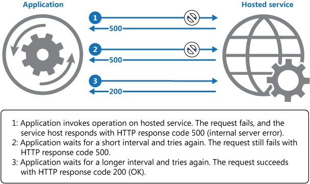

## Giới thiệu
Retry Pattern cho phép một ứng dụng (application) xử lý các lỗi tạm thời khi nó cố gắng kết nối với một dịch vụ (service) hoặc tài nguyên mạng (network resource), bằng cách thử lại (retrying) một thao tác thất bại một cách trong suốt. Điều này có thể cải thiện sự ổn định của ứng dụng (application).)

## Đặt vấn đề
Một ứng dụng (application) mà giao tiếp với thành phần chạy trong đám mây (cloud) thường phải đối mặt với các lỗi tạm thời có thể xảy ra trong môi trường này. Các lỗi bao gồm việc mất kết nối mạng tạm thời đến các thành phần và dịch vụ (services), hoặc services tạm thời bị lỗi hoặc xảy ra timeout khi services bị quá tải.

Những lỗi này thường tự khắc phục, và nếu cố gắng thử xử lý lại sau một khoảng trễ phù hợp, nó có khả năng thành công. Ví dụ, một dịch vụ cơ sở dữ liệu (database service) đang xử lý một số lớn yêu cầu đồng thời có thể đang áp dụng một cơ chế giảm tốc (throttling strategy) để tạm thời từ chối bất kỳ yêu cầu tiếp theo nào cho đến khi khối lượng công việc của nó đã giảm. Một ứng dụng cố gắng truy cập vào cơ sở dữ liệu vào thời điểm đó có thể thất bại trong việc kết nối, nhưng nếu nó thử lại sau một khoảng trễ, nó có thể thành công.

## Giải pháp
Trong đám mây (cloud), các lỗi tạm thời không phải là hiếm và một ứng dụng (application) nên được thiết kế để xử lý chúng một cách trong suốt. Điều này giảm thiểu tác động mà lỗi có thể gây ra cho các bài toán kinh doanh mà ứng dụng đang thực hiện.

Nếu một ứng dụng phát hiện lỗi khi nó cố gắng gửi một yêu cầu đến một dịch vụ từ xa (remote service), nó có thể xử lý lỗi bằng cách sử dụng các chiến lược sau:
- Hủy (Cancel). Nếu lỗi cho thấy rằng thất bại không phải là tạm thời hoặc không có khả năng thành công nếu lặp lại, ứng dụng nên hủy thao tác và ném ra một ngoại lệ. Ví dụ, một lỗi xác thực do cung cấp thông tin xác thực không hợp lệ không có khả năng thành công cho dù nó được thử nhiều lần.
- Thử lại (Retry). Nếu lỗi cụ thể được cho là không thường xảy ra hoặc hiếm gặp, nó có thể đã được gây ra bởi các hoàn cảnh hiếm gặp như một gói dữ liệu mạng bị hỏng trong khi đang được truyền đi. Trong trường hợp này, ứng dụng có thể thử lại yêu cầu thất bại ngay lập tức vì lỗi tương tự không có khả năng lặp lại và yêu cầu có thể thành công.
- Thử lại sau khoảng trễ (Retry after delay). Nếu lỗi được gây ra bởi một trong những lỗi kết nối hoặc quá tải, mạng hoặc dịch vụ có thể cần chờ một khoảng thời gian ngắn trong khi các vấn đề kết nối được sửa chữa hoặc tải của service được giải phóng. Ứng dụng nên chờ một thời gian phù hợp trước khi thử lại yêu cầu.

Đối với những lỗi tạm thời phổ biến hơn, khoảng thời gian giữa các lần thử lại nên được chọn để phân phối đều các yêu cầu vào nhiều instances của ứng dụng một cách đều nhất có thể. Điều này giảm khả năng dịch vụ bị quá tải. Lưu ý rằng, nếu nhiều instances của một ứng dụng bị liên tục quá tải bởi một dịch vụ (service) với các yêu cầu thử lại, nó sẽ mất thời gian lâu hơn để dịch vụ phục hồi.

Nếu yêu cầu vẫn thất bại, ứng dụng có thể chờ và thử một lần nữa. Nếu cần, quy trình này có thể được lặp lại với việc tăng dần khoảng trễ giữa các lần thử lại, cho đến khi một số lượng yêu cầu tối đa đã được thử. Khoảng trễ có thể được tăng lên theo cách tăng dần hoặc theo cấp số mũ, tùy thuộc vào loại lỗi và khả năng nó sẽ được sửa chữa trong thời gian này.

Sơ đồ sau minh họa việc gọi một xử lý trong một dịch vụ bằng cách sử dụng kiểu mẫu này. Nếu yêu cầu không thành công sau một số lần thử được xác định trước, ứng dụng nên coi lỗi như một ngoại lệ và xử lý nó cho phù hợp.



Ứng dụng nên đóng gói cách thực thi xử lý gọi lại tới 1 remote service trong một thư viện code, để quy chuẩn cách thực hiện một chính sách thử lại phù hợp với một trong những chiến lược được liệt kê ở trên. Các yêu cầu (request) gửi đến các dịch vụ (service) khác nhau có thể tuân theo các chính sách khác nhau. Một số thư viện đã thực thi sẵn các chính sách thử lại, nơi mà bạn có thể cấu hình số lần thử lại tối đa, thời gian giữa các lần thử lại, và các tham số khác.

Một ứng dụng nên ghi log chi tiết về lỗi và các hoạt động thất bại. Thông tin này rất hữu ích cho các bên vận hành. Để tránh làm cho các bên vận hành bị qúa tải với các cảnh báo về các xử lý mà sau khi thử lại lại thành công, tốt nhất là ghi các lỗi xảy ở các lần thử trước như các mục thông tin và chỉ lỗi của lần thử lại cuối cùng như một lỗi thực sự. Dưới đây là một ví dụ về cách ghi log áp dụng cho các lỗi thử lại.

```text
Handler - Attempt 1
Info  NServiceBus.RecoverabilityExecutor.
  Text: Immediate Retry is going to retry message 'messageId' because of an exception:

Handler - Attempt 2
Info  NServiceBus.RecoverabilityExecutor.
  Text: Immediate Retry is going to retry message 'messageId' because of an exception:

Handler - Attempt 3
Info  NServiceBus.RecoverabilityExecutor.
  Text: Immediate Retry is going to retry message 'messageId' because of an exception:

..................................................................................................

Handler - Attempt 12
Error NServiceBus.RecoverabilityExecutor.
  Text: Moving message 'messageId' to the error queue 'error' because processing failed due to an exception:
```

Nếu một dịch vụ thường xuyên không có sẵn hoặc quá tải, thì thường là do vì dịch vụ đã cạn kiệt tài nguyên. Bạn có thể giảm tần suất của những lỗi này bằng cách nâng cấp mở rộng (scale) dịch vụ. Ví dụ, nếu một dịch vụ cơ sở dữ liệu liên tục bị quá tải, có thể hữu ích khi scale phân tán cơ sở dữ liệu và phân phối tải trên nhiều máy chủ.

## Vấn đề và các yếu tố cần xem xét
Bạn nên xem xét các điểm sau khi quyết định cách triển khai mô hình này.

Chính sách thử lại (retry policy) nên được điều chỉnh để phù hợp với yêu cầu kinh doanh của ứng dụng và tính chất của lỗi. Đối với một số hoạt động không quan trọng, thì tốt hơn là lỗi ngay (fail fast) hơn là thử lại nhiều lần và ảnh hưởng đến thông lượng và tải của ứng dụng. Ví dụ, trong một ứng dụng web tương tác truy cập một dịch vụ từ xa, thì tốt hơn là thất bại sau một số lượng nhỏ lần thử lại với chỉ một khoảng trễ ngắn giữa các lần thử lại, và hiển thị một thông báo phù hợp cho người dùng (ví dụ, "vui lòng thử lại sau"). Đối với một ứng dụng xử lý batch, sẽ phù hợp hơn khi tăng số lượng lần thử lại với một khoảng trễ gia tăng theo hàm mũ giữa các lần thử.

Một chính sách thử lại (retry policy) quá nhanh với khoảng trễ quá nhỏ giữa các lần thử, và một số lượng lớn lần thử lại, có thể khiến một dịch vụ trở nên quá tải. Chính sách thử lại này cũng có thể ảnh hưởng đến khả năng phản hồi của ứng dụng nếu nó liên tục cố gắng thực hiện thử lại một xử lý thất bại.

Nếu một yêu cầu vẫn thất bại sau một số lượng đáng kể các lần thử lại, thì tốt hơn hết và an toàn cho ứng dụng là ngăn chặn các yêu cầu tiếp theo đến cùng một nguồn và đơn giản ném ra lỗi ngay lập tức. Khi thời gian ngăn chặn hết hạn, ứng dụng có thể cho phép một cách dè dặt một hoặc nhiều yêu cầu thông qua để xem liệu chúng có thành công hay không. Để biết thêm chi tiết về chiến lược này, xem kiểu mẫu `Circuit Breaker`.

Xem xét liệu xử lý có idempotent hay không. Nếu có, thì việc thử lại vốn là an toàn. Ngược lại, việc thử lại có thể khiến xử lý bị thực hiện nhiều hơn một lần, với các lỗi không mong muốn. Ví dụ, một dịch vụ có thể nhận được yêu cầu, xử lý yêu cầu thành công, nhưng không thể gửi một phản hồi. Tại thời điểm đó, logic thử lại có thể gửi lại yêu cầu đó với giả định rằng yêu cầu trước đó không được nhận.

Một yêu cầu đến một dịch vụ có thể thất bại vì nhiều lý do khác nhau, tạo ra các ngoại lệ khác nhau tùy thuộc vào tính chất của lỗi. Một số ngoại lệ cho thấy một thất bại có thể được giải quyết nhanh chóng, trong khi một số khác cho thấy thất bại kéo dài lâu hơn. Việc điều chỉnh thời gian giữa các lần thử lại dựa trên loại ngoại lệ là hữu ích cho chính sách thử lại (retry policy).

Cần xem xét việc thử lại một xử lý là một phần của giao dịch sẽ ảnh hưởng đến tính nhất quán của giao dịch tổng thể như thế nào. Tinh chỉnh chính sách thử lại cho các xử lý giao dịch để tối đa hóa cơ hội thành công và giảm thiểu nguy cơ hủy bỏ tất cả các bước giao dịch.

Đảm bảo rằng tất cả mã thử lại đã được kiểm tra đầy đủ đối với một loạt các điều kiện thất bại. Kiểm tra xem nó có ảnh hưởng nghiêm trọng đến hiệu suất hoặc độ tin cậy của ứng dụng, gây ra tải quá mức đối với dịch vụ và tài nguyên, hoặc tạo ra các tình huống tranh chấp hay các điểm nghẽn không.

Chỉ triển khai logic thử lại (retry logic) ở nơi toàn bộ ngữ cảnh của một xử lý thất bại được hiểu rõ. Ví dụ, nếu một tác vụ chứa chính sách thử lại gọi đến một tác vụ khác mà cũng chứa chính sách thử lại, việc lồng thêm việc thử lại có thể làm chậm thêm trong quá trình xử lý. Tốt hơn khi cấu hình tác vụ cấp thấp hãy để cho thất bại nhanh (fail fast) và ném ra lý do lỗi trả lại tác vụ đã gọi nó. Tác vụ cấp cao hơn này sau đó có thể xử lý lỗi dựa trên chính sách của riêng nó.

Việc ghi log tất cả các lỗi kết nối mà gây ra việc thử lại là quan trọng để có thể xác định các vấn đề gốc rễ với ứng dụng, dịch vụ, hoặc tài nguyên.

Đào sâu vào các lỗi có khả năng xảy ra nhất cho một dịch vụ hoặc tài nguyên để phát hiện xem chúng có khả năng kéo dài lâu hay là lỗi cuối cùng hay không. Nếu chúng là như vậy, thì tốt hơn là xử lý lỗi như một ngoại lệ. Ứng dụng có thể báo cáo hoặc ghi log ngoại lệ, và sau đó cố gắng tiếp tục bằng cách gọi một dịch vụ thay thế (nếu có sẵn), hoặc bằng cách đưa ra cơ chế xử lý giảm dần. Để biết thêm thông tin về cách phát hiện và xử lý các lỗi kéo dài lâu, xem kiểu mẫu `Circuit Breaker`.

## Khi nào nên sử dụng kiểu mẫu này
Sử dụng kiểu mẫu này khi một ứng dụng có thể gặp phải các lỗi tạm thời khi nó tương tác với một dịch vụ từ xa hoặc truy cập một tài nguyên từ xa. Những lỗi này được dự đoán sẽ kéo dài trong thời gian ngắn, và việc lặp lại một yêu cầu đã thất bại trước đó có thể thành công trong một lần thử tiếp theo.

Mô hình này có thể không hữu ích:
- Khi một lỗi có khả năng kéo dài lâu, bởi vì nó có thể ảnh hưởng đến khả năng phản hồi của một ứng dụng. Ứng dụng có thể đang lãng phí thời gian và tài nguyên để cố gắng lặp lại một yêu cầu có khả năng thất bại.
- Đối với việc xử lý những thất bại không phải do các lỗi tạm thời, chẳng hạn như các ngoại lệ nội bộ do lỗi trong logic kinh doanh của một ứng dụng.
- Như một phương pháp thay thế để xác định các vấn đề liên quan tới khả năng mở rộng trong một hệ thống. Nếu một ứng dụng thường xuyên gặp phải lỗi quá tải, đó thường là dấu hiệu rằng dịch vụ hoặc tài nguyên đang được truy cập nên được mở rộng.

## Ví dụ minh họa
Ví dụ sau đây trong C# minh họa một cách triển khai mẫu Retry. Phương thức `OperationWithBasicRetryAsync`, được hiển thị dưới đây, gọi đến một dịch vụ bên ngoài một cách bất đồng bộ thông qua phương thức `TransientOperationAsync`.
    
```c#
private int retryCount = 3;
private readonly TimeSpan delay = TimeSpan.FromSeconds(5);

public async Task OperationWithBasicRetryAsync()
{
  int currentRetry = 0;

  for (;;)
  {
    try
    {
      // Call external service.
      await TransientOperationAsync();

      // Return or break.
      break;
    }
    catch (Exception ex)
    {
      Trace.TraceError("Operation Exception");

      currentRetry++;

      // Check if the exception thrown was a transient exception
      // based on the logic in the error detection strategy.
      // Determine whether to retry the operation, as well as how
      // long to wait, based on the retry strategy.
      if (currentRetry > this.retryCount || !IsTransient(ex))
      {
        // If this isn't a transient error or we shouldn't retry,
        // rethrow the exception.
        throw;
      }
    }

    // Wait to retry the operation.
    // Consider calculating an exponential delay here and
    // using a strategy best suited for the operation and fault.
    await Task.Delay(delay);
  }
}

// Async method that wraps a call to a remote service (details not shown).
private async Task TransientOperationAsync()
{
  ...
}
```

Lệnh gọi đến phương thức này nằm trong một khối try/catch được bao bọc bởi một vòng lặp for. Vòng lặp for sẽ thoát nếu gọi đến phương thức `TransientOperationAsync` thành công mà không ném ra ngoại lệ. Nếu phương thức `TransientOperationAsync` thất bại, khối catch sẽ kiểm tra lý do của sự thất bại. Nếu nó được cho là một lỗi tạm thời, mã code sẽ đợi một khoảng trễ ngắn trước khi thử lại xử lý.

Vòng lặp for cũng theo dõi số lần xử lý đã được thử, và nếu mã thất bại ba lần, ngoại lệ được cho là kéo dài lâu hơn. Nếu ngoại lệ không phải là tạm thời hoặc kéo dài lâu, trình xử lý catch sẽ ném một ngoại lệ. Ngoại lệ này thoát khỏi vòng lặp for và nên được bắt bởi mã gọi đến phương thức `OperationWithBasicRetryAsync`.

Phương thức `IsTransient`, được hiển thị dưới đây, kiểm tra một tập hợp cụ thể các ngoại lệ liên quan đến môi trường mà mã đang chạy. Định nghĩa của một ngoại lệ tạm thời sẽ thay đổi theo các tài nguyên đang được truy cập và môi trường mà xử lý đang được thực hiện.

```c#
private bool IsTransient(Exception ex)
{
  // Determine if the exception is transient.
  // In some cases this is as simple as checking the exception type, in other
  // cases it might be necessary to inspect other properties of the exception.
  if (ex is OperationTransientException)
    return true;

  var webException = ex as WebException;
  if (webException != null)
  {
    // If the web exception contains one of the following status values
    // it might be transient.
    return new[] {WebExceptionStatus.ConnectionClosed,
                  WebExceptionStatus.Timeout,
                  WebExceptionStatus.RequestCanceled }.
            Contains(webException.Status);
  }

  // Additional exception checking logic goes here.
  return false;
}
```