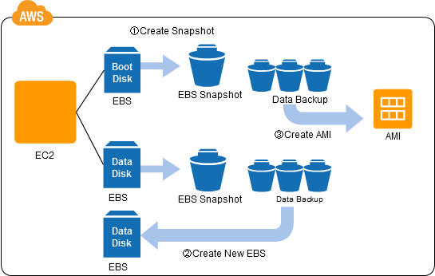

## Đặt vấn đề
Một trong những điều quan trọng nhất của hệ thống là dữ liệu (data) của bạn phải được đảm bảo an toàn. Điều này có nghĩa là việc sao lưu (backup) dữ liệu là rất quan trọng. Ví dụ, bạn có thể sao lưu (backup) dữ liệu thành nhiều phiên bản được lưu trữ ở những nơi khác nhau. Tuy nhiên, với việc sao lưu này, bạn phải chịu chi phí về thay đổi và lưu trữ các phiên bản, và đây là những hoạt động cần phải được tự động hóa (automate).

## Giải pháp trên Cloud
Đám mây AWS (AWS Cloud) cho phép bạn sử dụng "Internet storage" không giới hạn (còn được gọi là "Web Storage") một cách an toàn và với chi phí tương đối thấp.

Trong Đám mây AWS, chúng ta thường nói về "snapshot", đó là bản sao lưu (backup) của dữ liệu của bạn tại một thời điểm nhất định. Đám mây AWS cho phép bạn sao chép dữ liệu của một máy chủ ảo (bao gồm cả hệ điều hành), cùng với dữ liệu khác, đến "Internet storage" một cách dễ dàng, giúp bạn dễ dàng chụp những "snapshots" này theo các khoảng thời gian định kỳ. Bạn có thể chụp một "snapshot" chỉ với một cú nhấp chuột vào Nút điều khiển (Control Screen), hoặc bạn có thể chụp một "snapshot" bằng cách sử dụng một API. Đó là, bạn có thể tự động hóa nó bằng cách lập trình. 
Bởi vì với "Internet Storage", bạn không cần phải lo lắng về dung lượng (capacity), bạn có thể tự động hóa quá trình sao lưu bằng cách thiết lập chụp "snapshots" một cách định kỳ.

Khi thực hiện kiểm tra bản cập nhật của chương trình hoặc tạo môi trường thử nghiệm tạm thời, bản chụp "snapshot" là giải pháp hoàn hảo cho điều này.

## Cách triển khai
Elastic Block Store (EBS), là bộ nhớ lưu trữ ảo trong AWS, có chức năng chụp ảnh nhanh (snapshot). Hãy tạo một snapshot bằng cách sử dụng chức năng này. Khi bạn chụp ảnh nhanh, nó được lưu trữ trong dịch vụ lưu trữ đối tượng Amazon Simple Storage Service (S3), được thiết kế để có độ sẵn sàng là 99.999999999%.

Khi sử dụng chức năng snapshot của EBS, tất cả dữ liệu cần thiết để tái tạo volume EBS được sao chép vào S3. Một snapshot đã được lưu trữ trong S3 có thể được khôi phục như một volume EBS mới. Ngay cả khi dữ liệu bị mất hoặc bị hỏng trong EBS, bạn có thể khôi phục dữ liệu từ thời điểm chụp ảnh nhanh (snapshot).

Khi bạn sử dụng EBS như một đĩa dữ liệu, bạn có thể sao lưu dữ liệu của mình bất kỳ lúc nào bằng cách chụp ảnh nhanh. Bạn có thể tạo nhiều bản sao lưu mới cần thiết, bất cứ khi nào cần thiết, mà không cần lo lắng về dung lượng lưu trữ.

Khi bạn sử dụng EBS như một đĩa khởi động, bạn có thể tạo một bản sao cho mỗi hệ điều hành, và lưu trữ nó dưới dạng Hình ảnh Máy Amazon (Amazon Machine Image - AMI). Bạn có thể khởi chạy một thực thể EC2 mới từ dữ liệu đó.

## Ưu điểm
- Việc sao lưu có thể được kiểm soát bởi một chương trình máy tính. Điều này nghĩa là, bạn có thể tự động hóa quy trình, thay vì phải sao lưu thủ công.
- Bạn có thể sử dụng S3, với độ sẵn sàng cao, đảm bảo an toàn cho việc sao lưu dữ liệu.
- Bạn có thể sao lưu tất cả dữ liệu trên volume EBS dưới dạng một snapshot, cho phép sử dụng ngay lập tức snapshot để tạo ra một volume EBS mới. Điều này giúp việc khôi phục dễ dàng trong trường hợp gặp sự cố.
- Bạn có thể sao lưu không chỉ dữ liệu của người dùng, mà còn của từng hệ điều hành riêng lẻ nữa. Bởi vì bản sao lưu cho mỗi hệ điều hành được lưu trữ dưới dạng Hình ảnh Máy Amazon (AMI), bạn có thể khởi động các thực thể EC2 mới.
- Bạn có thể sao lưu dữ liệu dưới các điều kiện cụ thể (ví dụ, sau khi thay thế một ứng dụng hoặc sau khi cập nhật dữ liệu), và có thể sao lưu nhiều thế hệ, mà không phải lo lắng về dung lượng lưu trữ. Điều này cho phép bạn xây dựng lại môi trường một cách dễ dàng sau một sự cố hoặc vấn đề, cho phép bạn quay trở lại môi trường của bất kỳ thời điểm nào trong quá khứ.

## 1 vài lưu ý
- Bạn phải duy trì sự nhất quán của dữ liệu khi chụp ảnh nhanh (snapshots). Khi bạn chụp ảnh nhanh với volume EBS được gắn kết (mounted), hãy đảm bảo chụp ảnh nhanh trong trạng thái đã đạt được sự nhất quán logic, ví dụ, sau khi xóa bộ nhớ đệm của hệ thống tệp (EXT hoặc NTFS), và sau khi các giao dịch ứng dụng đã hoàn thành.
- Thông thường, kích thước dữ liệu của đĩa khởi động (boot disk) càng nhỏ, máy chủ ảo có thể được khởi động nhanh hơn. Lưu ý rằng việc kiểm tra đĩa được thực hiện định kỳ (fsck trong Linux) cũng tốn thời gian.
- Bạn có thể muốn tách phân vùng khởi động (boot partition) và phân vùng dữ liệu ( data partition ) thành các volume EBS riêng biệt khi sao lưu, bởi vì có thể bạn sẽ muốn sao lưu các phần dữ liệu của mình thường xuyên hơn so với các phần khởi động.
